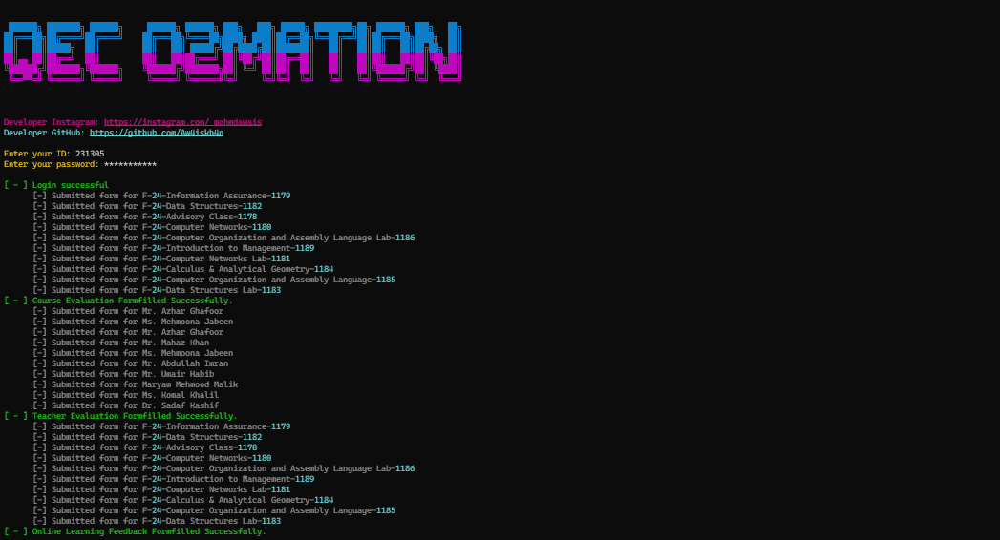

# AU QEC Form Filler


## Overview

AU QEC Form Filler is a Python script designed to automate the process of filling out various forms on the AU (Air University) QEC (Quality Enhancement Cell) portal. This tool simplifies the task of completing Course QEC forms, Teacher Evaluation forms, and Online Learning Feedback forms.

`### Note:` Version 2.0 is currently compatible only with the Windows operating system. A Linux-compatible version will be released soon.

## Features

- Automated login to the AU QEC portal.
- Fills out Course QEC forms for all available subjects.
- Completes Teacher Evaluation forms for all listed teachers.
- Submits Online Learning Feedback forms for all available courses.
- Rich terminal output for better user experience.

## Executable

You can also download and run the executable file directly without setting up the Python environment. 

### Download and Run the Executable

1. Download the latest executable file from the [releases](https://github.com/Aw4iskh4n/au-qec-form-filler/releases) page.
2. Run the executable file (`QEC.exe`).
3. Enter your login credentials when prompted.

## Requirements

- Python 3.6 or higher
- `requests` library
- `beautifulsoup4` library
- `rich` library

## Installation

1. Clone the repository:
    ```bash
    git clone https://github.com/Aw4iskh4n/au-qec-form-filler.git
    ```
2. Navigate to the project directory:
    ```bash
    cd au-qec-form-filler
    ```
3. Install the required dependencies:
    ```bash
    pip install -r requirements.txt
    ```

## Usage

1. Run the script:
    ```bash
    python o2mation.py
    ```
2. Enter your login credentials when prompted.



## License

This project is licensed under the MIT License.

## Contributing

Contributions are welcome! Please open an issue or submit a pull request for any improvements or bug fixes.


**Disclaimer:** This tool is intended for educational purposes only. Use it responsibly and at your own risk.
